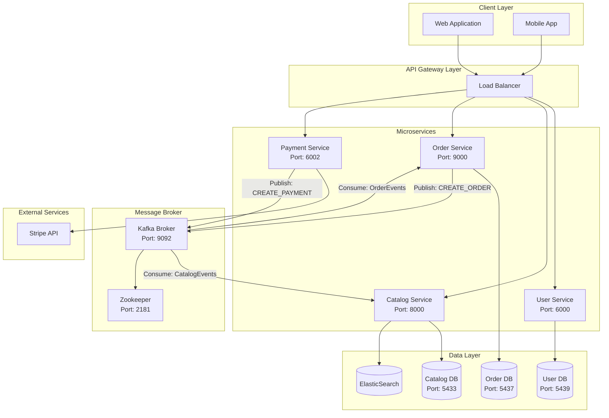
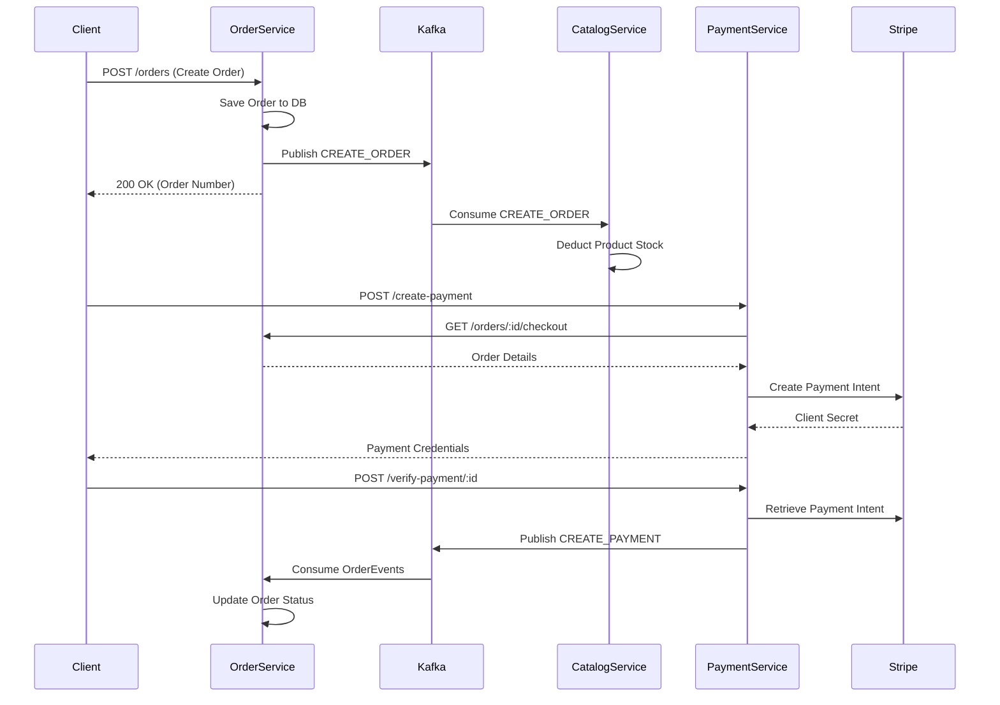
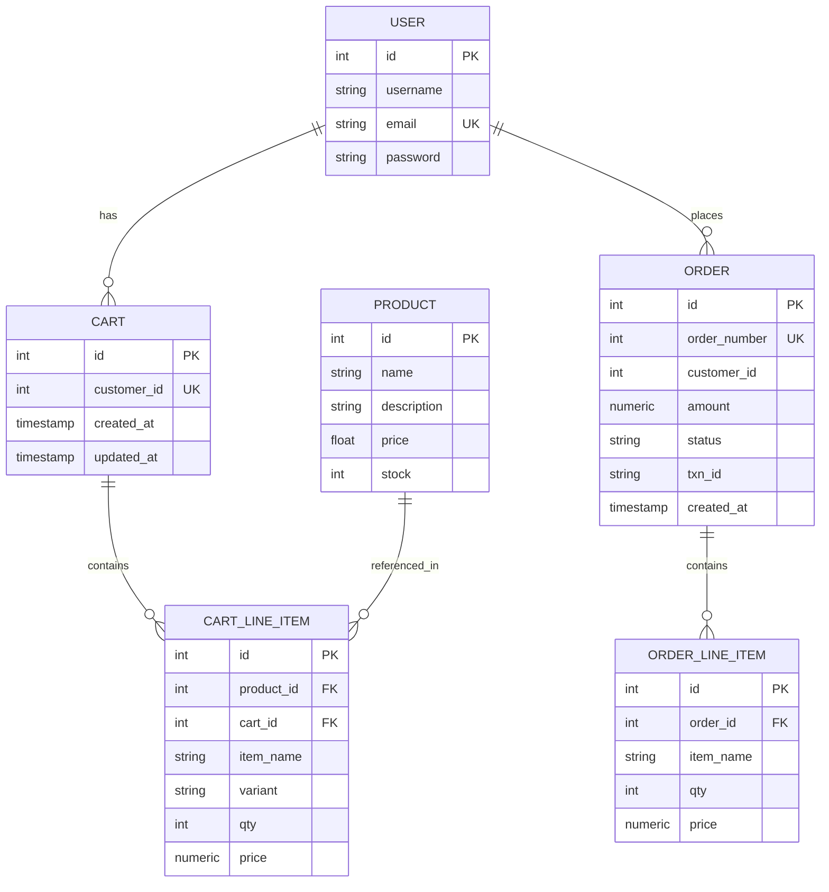

# Microservices E-Commerce Platform - Technical Documentation

> **Version:** 1.0  
> **Last Updated:** January 2026  
> **Tech Stack:** Node.js, TypeScript, Express.js, PostgreSQL, Apache Kafka, Docker

---

## Table of Contents

1. [Executive Summary](#1-executive-summary)
2. [System Architecture](#2-system-architecture)
3. [Infrastructure & DevOps](#3-infrastructure--devops)
4. [Service Specifications](#4-service-specifications)
   - [User Service](#41-user-service)
   - [Catalog Service](#42-catalog-service)
   - [Order Service](#43-order-service)
   - [Payment Service](#44-payment-service)
5. [Database Schemas](#5-database-schemas)
6. [Event-Driven Architecture](#6-event-driven-architecture)
7. [API Reference](#7-api-reference)
8. [Directory Structure](#8-directory-structure)

---

## 1. Executive Summary

This project implements a **microservices-based e-commerce backend** designed for scalability, maintainability, and loose coupling. The system handles user authentication, product catalog management, shopping cart operations, order processing, and payment integration via Stripe.

### Key Architectural Decisions

| Decision | Implementation |
|:---------|:---------------|
| **Communication** | Synchronous (REST) for user-facing APIs; Asynchronous (Kafka) for inter-service events |
| **Database Strategy** | Database-per-service pattern with PostgreSQL |
| **Search** | ElasticSearch for product catalog queries |
| **Authentication** | JWT-based stateless authentication |
| **Payment** | Stripe Payment Intents API |

---

## 2. System Architecture

### High-Level Overview



### Communication Patterns



---

## 3. Infrastructure & DevOps

### Docker Compose Configuration

#### Kafka Broker (`broker/docker-compose.yml`)

```yaml
services:
  zookeeper:
    image: confluentinc/cp-zookeeper:6.2.0
    environment:
      ZOOKEEPER_CLIENT_PORT: 2181
    ports:
      - "2181:2181"

  kafka:
    image: confluentinc/cp-kafka:6.2.0
    depends_on:
      - zookeeper
    environment:
      KAFKA_BROKER_ID: 1
      KAFKA_ZOOKEEPER_CONNECT: "zookeeper:2181"
      KAFKA_LISTENERS: "PLAINTEXT://0.0.0.0:9092"
      KAFKA_ADVERTISED_LISTENERS: "PLAINTEXT://localhost:9092"
      KAFKA_OFFSETS_TOPIC_REPLICATION_FACTOR: 1
    ports:
      - "9092:9092"
```

#### Database Servers (`db/docker-compose.yml`)

| Service | Image | Port | Database Name | Credentials |
|:--------|:------|:-----|:--------------|:------------|
| `catalog_db_server` | postgres:14.0 | 5433 | `catalog_service` | `catalog_db` / `catalog_db_password` |
| `order_db_server` | postgres:14.0 | 5437 | `order_service` | `order_db` / `order_db_password` |
| `user_db_server` | postgres:14.0 | 5439 | `user_service` | `user_db` / `user_db_password` |

### Environment Variables

Each service requires a `.env` file with the following variables:

```env
# Common
PORT=<service_port>
DATABASE_URL=postgresql://<user>:<password>@localhost:<port>/<db_name>

# User Service
JWT_SECRET=<secret_key>

# Catalog Service  
ELASTICSEARCH_URL=http://localhost:9200

# Payment Service
STRIPE_SECRET_KEY=<stripe_secret>
STRIPE_PUB_KEY=<stripe_publishable>
```

---

## 4. Service Specifications

### 4.1 User Service

> **Location:** `user_service/`  
> **Port:** 6000  
> **Database:** PostgreSQL (Raw `pg` client)

#### Purpose
Handles user registration, authentication, and JWT token management.

#### Technology Stack
| Component | Technology |
|:----------|:-----------|
| Framework | Express.js 5.x |
| Database | `pg` (node-postgres) |
| Auth | `bcryptjs`, `jsonwebtoken` |
| Validation | Manual |

#### File Structure
```
user_service/
├── app.ts                 # Entry point, server initialization
├── config/
│   └── db.ts              # PostgreSQL connection pool
├── routes/
│   └── authRoutes.routes.ts  # Authentication endpoints
├── types/
│   └── types.types.ts     # Type definitions
└── db.sql                 # Schema creation script
```

#### Core Functions

| Function | Location | Description |
|:---------|:---------|:------------|
| `generateToken(user)` | `authRoutes.routes.ts:10` | Creates JWT with user ID and email |
| `POST /register` | `authRoutes.routes.ts:16` | Hashes password with bcrypt, saves user |
| `POST /login` | `authRoutes.routes.ts:39` | Validates credentials, returns JWT |
| `GET /validate` | `authRoutes.routes.ts:61` | Verifies JWT from Authorization header |

#### Database Connection

```typescript
// config/db.ts
const pool = new Pool({
  connectionString: process.env.DATABASE_URL,
});

export = {
  query: (text: string, params: any) => pool.query(text, params),
};
```

---

### 4.2 Catalog Service

> **Location:** `catalog_service/`  
> **Port:** 8000  
> **Database:** PostgreSQL (Prisma ORM) + ElasticSearch

#### Purpose
Manages product inventory, CRUD operations, and full-text search. Consumes Kafka events to update stock after orders are placed.

#### Technology Stack
| Component | Technology |
|:----------|:-----------|
| Framework | Express.js 5.x |
| ORM | Prisma 6.x |
| Search | ElasticSearch 8.x |
| Message Queue | KafkaJS |
| Validation | `class-validator` |
| Logging | Pino |

#### File Structure
```
catalog_service/src/
├── api/
│   └── catalog.routes.ts      # Product CRUD endpoints
├── services/
│   ├── catalog.service.ts     # Business logic
│   ├── broker.service.ts      # Kafka producer/consumer
│   └── elasticSearchService.ts # ES integration
├── repository/
│   ├── catalog.repository.ts  # Prisma data access
│   └── mockCatalog.repository.ts # Test mock
├── dto/
│   └── product.dto.ts         # Request validation classes
├── interface/
│   └── catelogRepository.interface.ts # Repository contract
├── models/
│   └── product.model.ts       # Product type
├── utils/
│   ├── AppEventListener.ts    # Internal event bus
│   ├── broker/                # Kafka utilities
│   ├── error/                 # Error handling
│   └── logger/                # Pino logger
└── expressApp.ts              # App configuration
```

#### Core Functions

| Function | Location | Description |
|:---------|:---------|:------------|
| `createProduct(input)` | `catalog.service.ts:15` | Creates product in DB, emits ElasticSearch sync event |
| `updateProduct(input)` | `catalog.service.ts:28` | Updates product, syncs to ElasticSearch |
| `getProducts(limit, offset, search)` | `catalog.service.ts:43` | Queries ElasticSearch for products |
| `getProductStock(ids)` | `catalog.service.ts:65` | Bulk stock lookup for cart validation |
| `handleBrokerMessage(message)` | `catalog.service.ts:73` | **Kafka Consumer** - Deducts stock on order creation |

#### Kafka Integration

```typescript
// services/broker.service.ts
public async initializeBroker() {
  this.producer = await MessageBroker.connectProducer<Producer>();
  this.consumer = await MessageBroker.connectConsumer<Consumer>();
  
  // Subscribe to CatalogEvents topic
  await MessageBroker.subscribe(
    this.catelogService.handleBrokerMessage.bind(this.catelogService),
    "CatalogEvents"
  );
}
```

#### Repository Pattern

```typescript
// interface/catelogRepository.interface.ts
export interface IcatalogRepository {
  create(data: Product): Promise<Product>;
  update(data: Product): Promise<Product>;
  delete(id: any): any;
  find(limit: number, offset: number): Promise<Product[]>;
  findOne(id: number): Promise<Product>;
  findStock(ids: number[]): Promise<Product[]>;
}
```

---

### 4.3 Order Service

> **Location:** `order_service/`  
> **Port:** 9000 (inferred)  
> **Database:** PostgreSQL (Drizzle ORM)

#### Purpose
Manages shopping carts, order creation, and order lifecycle. Publishes events to Kafka when orders are created or cancelled.

#### Technology Stack
| Component | Technology |
|:----------|:-----------|
| Framework | Express.js 5.x |
| ORM | Drizzle ORM 0.44.x |
| Validation | `ajv` (JSON Schema) |
| Message Queue | KafkaJS |
| Logging | Pino |

#### File Structure
```
order_service/src/
├── routes/
│   ├── cart.routes.ts         # Shopping cart endpoints
│   ├── order.routes.ts        # Order management endpoints
│   └── middleware.ts          # Auth middleware
├── service/
│   ├── cart.service.ts        # Cart business logic
│   ├── order.service.ts       # Order business logic
│   └── broker.service.ts      # Kafka producer
├── repository/
│   ├── cart.repository.ts     # Cart data access
│   └── order.repository.ts    # Order data access
├── db/
│   ├── schema/
│   │   ├── cart.ts            # Drizzle cart schema
│   │   └── order.ts           # Drizzle order schema
│   ├── migrations/            # SQL migration files
│   └── db.connection.ts       # DB connection
├── dto/
│   ├── cartRequest.dto.ts     # Cart validation
│   └── orderRequest.dto.ts    # Order types
├── utils/
│   ├── broker/
│   │   ├── api.ts             # HTTP calls to other services
│   │   └── message-broker.ts  # Kafka wrapper
│   └── error/                 # Error handling
└── express-app.ts             # App configuration
```

#### Core Functions

| Function | Location | Description |
|:---------|:---------|:------------|
| `CreateCart(input, repo)` | `cart.service.ts:8` | Validates stock via Catalog Service, creates/updates cart |
| `GetCart(id, repo)` | `cart.service.ts:35` | Returns cart with real-time stock availability |
| `CreateOrder(userId, repo, cartRepo)` | `order.service.ts:7` | Converts cart to order, **publishes CREATE_ORDER to Kafka** |
| `CheckoutOrder(orderNumber, repo)` | `order.service.ts:101` | Retrieves order for payment processing |
| `SendCreateOrderMessage(data)` | `broker.service.ts:26` | Publishes order data to `CatalogEvents` topic |

#### Kafka Producer

```typescript
// service/broker.service.ts
export const SendCreateOrderMessage = async (data: any) => {
  await MessageBroker.publish({
    event: OrderEvent.CREATE_ORDER,
    topic: "CatalogEvents",
    headers: {},
    message: data
  });
};
```

#### Inter-Service Communication

```typescript
// utils/broker/api.ts
export const GetProductDetails = async (productId: number) => {
  const response = await axios.get(`${CATALOG_SERVICE_URL}/products/${productId}`);
  return response.data;
};

export const GetStockDetails = async (ids: number[]) => {
  const response = await axios.post(`${CATALOG_SERVICE_URL}/products/stock`, { ids });
  return response.data;
};
```

---

### 4.4 Payment Service

> **Location:** `payment_service/`  
> **Port:** 6002  
> **Database:** None (stateless, uses Stripe)

#### Purpose
Handles payment processing via Stripe. Creates payment intents, verifies payments, and publishes payment events to update order status.

#### Technology Stack
| Component | Technology |
|:----------|:-----------|
| Framework | Express.js 5.x |
| Payment | Stripe SDK 20.x |
| Validation | `ajv` |
| Message Queue | KafkaJS |
| Logging | Pino |

#### File Structure
```
payment_service/src/
├── routes/
│   ├── payment.routes.ts      # Payment endpoints
│   └── middleware.ts          # Auth middleware
├── service/
│   ├── payment.service.ts     # Payment business logic
│   └── broker.service.ts      # Kafka producer
├── utils/
│   ├── payment/
│   │   ├── stripePayment.ts   # Stripe implementation
│   │   └── payment.type.ts    # Payment gateway interface
│   ├── broker/
│   │   └── message-broker.ts  # Kafka wrapper
│   └── error/                 # Error handling
└── express-app.ts             # App configuration
```

#### Core Functions

| Function | Location | Description |
|:---------|:---------|:------------|
| `CreatePayment(userId, orderNumber, gateway)` | `payment.service.ts:6` | Fetches order, creates Stripe PaymentIntent |
| `VerifyPayment(paymentId, gateway)` | `payment.service.ts:40` | Retrieves payment status, **publishes to Kafka** |
| `createPayment(amount, metadata)` | `stripePayment.ts:8` | Stripe API: Creates payment intent |
| `getPayment(paymentId)` | `stripePayment.ts:25` | Stripe API: Retrieves payment status |

#### Stripe Integration

```typescript
// utils/payment/stripePayment.ts
const stripe = new Stripe(process.env.STRIPE_SECRET_KEY as string, {
  apiVersion: "2025-11-17.clover",
});

const createPayment = async (
  amount: number,
  metadata: { orderNumber: number; userId: number }
): Promise<{ secret: string; pubKey: string; amount: number }> => {
  const paymentIntent = await stripe.paymentIntents.create({
    amount,
    currency: "usd",
    metadata,
  });

  return {
    secret: paymentIntent.client_secret as string,
    pubKey: process.env.STRIPE_PUB_KEY as string,
    amount: paymentIntent.amount
  };
};
```

#### Payment Gateway Interface

```typescript
// utils/payment/payment.type.ts
export interface PaymentGateway {
  createPayment(amount: number, metadata: object): Promise<PaymentResponse>;
  getPayment(paymentId: string): Promise<PaymentStatusResponse>;
}
```

---

## 5. Database Schemas

### User Service Schema

```sql
-- db.sql
CREATE TABLE "user" (
  id SERIAL PRIMARY KEY,
  username VARCHAR(255) NOT NULL,
  email VARCHAR(255) NOT NULL UNIQUE,
  password VARCHAR(255) NOT NULL
);
```

### Catalog Service Schema (Prisma)

```prisma
// prisma/schema.prisma
model Product {
  id          Int     @id @default(autoincrement())
  name        String
  description String
  price       Float
  stock       Int
}
```

### Order Service Schema (Drizzle)

```typescript
// db/schema/cart.ts
export const carts = pgTable("carts", {
  id: serial("id").primaryKey(),
  customerId: integer("customer_id").notNull().unique(),
  createdAt: timestamp("created_at").notNull().defaultNow(),
  updatedAt: timestamp("updated_at").notNull().defaultNow(),
});

export const cartLineItems = pgTable("cart_line_items", {
  id: serial("id").primaryKey(),
  productId: integer("product_id").notNull(),
  cartId: integer("cart_id").references(() => carts.id, { onDelete: "cascade" }).notNull(),
  itemName: varchar("item_name").notNull(),
  variant: varchar("variant"),
  qty: integer("qty").notNull(),
  price: numeric("amount").notNull(),
  createdAt: timestamp("created_at").notNull().defaultNow(),
  updatedAt: timestamp("updated_at").notNull().defaultNow(),
});
```

```typescript
// db/schema/order.ts
export const orders = pgTable("orders", {
  id: serial("id").primaryKey(),
  orderNumber: integer("order_number").notNull().unique(),
  customerId: integer("customer_id").notNull(),
  amount: numeric("amount").notNull(),
  status: varchar("status").default("pending"),
  txnId: varchar("txn_id"),
  createdAt: timestamp("created_at").notNull().defaultNow(),
  updatedAt: timestamp("updated_at").notNull().defaultNow(),
});

export const orderLineItems = pgTable("order_line_items", {
  id: serial("id").primaryKey(),
  itemName: varchar("item_name").notNull(),
  qty: integer("qty").notNull(),
  price: numeric("amount").notNull(),
  orderId: integer("order_id").references(() => orders.id, { onDelete: "cascade" }).notNull(),
  createdAt: timestamp("created_at").notNull().defaultNow(),
  updatedAt: timestamp("updated_at").notNull().defaultNow(),
});
```

### Entity Relationship Diagram



---

## 6. Event-Driven Architecture

### Kafka Topics

| Topic | Producer | Consumer | Events |
|:------|:---------|:---------|:-------|
| `CatalogEvents` | Order Service | Catalog Service | `CREATE_ORDER`, `CANCEL_ORDER` |
| `OrderEvents` | Payment Service | Order Service | `CREATE_PAYMENT` |

### Event Payloads

#### CREATE_ORDER Event
```json
{
  "event": "CREATE_ORDER",
  "data": {
    "orderNumber": 123456,
    "customerId": 1,
    "amount": "99.99",
    "status": "pending",
    "orderItems": [
      {
        "productId": 1,
        "itemName": "Product A",
        "qty": 2,
        "price": "49.99"
      }
    ]
  }
}
```

#### CREATE_PAYMENT Event
```json
{
  "event": "CREATE_PAYMENT",
  "data": {
    "orderNumber": 123456,
    "status": "succeeded",
    "paymentLog": { /* Stripe PaymentIntent object */ }
  }
}
```

### Message Broker Implementation

```typescript
// Shared Pattern: utils/broker/message-broker.ts
export const MessageBroker: MessageBrokerType = {
  connectProducer,      // Initialize Kafka producer
  disconnectProducer,   // Graceful shutdown
  publish,              // Send message to topic
  connectConsumer,      // Initialize Kafka consumer
  disconnectConsumer,   // Graceful shutdown
  subscribe,            // Listen to topic with handler
};
```

---

## 7. API Reference

### User Service Endpoints

| Method | Endpoint | Description | Auth | Request Body |
|:-------|:---------|:------------|:-----|:-------------|
| POST | `/auth/register` | Register new user | No | `{ username, email, password }` |
| POST | `/auth/login` | Authenticate user | No | `{ email, password }` |
| GET | `/auth/validate` | Validate JWT token | Yes | - |

### Catalog Service Endpoints

| Method | Endpoint | Description | Auth | Request Body |
|:-------|:---------|:------------|:-----|:-------------|
| POST | `/products` | Create product | Yes | `{ name, description, price, stock }` |
| PATCH | `/products/:id` | Update product | Yes | `{ name?, description?, price?, stock? }` |
| GET | `/products` | List products | No | Query: `limit`, `offset`, `search` |
| GET | `/products/:id` | Get product by ID | No | - |
| DELETE | `/products/:id` | Delete product | Yes | - |
| POST | `/products/stock` | Bulk stock check | Internal | `{ ids: [1, 2, 3] }` |

### Order Service Endpoints

| Method | Endpoint | Description | Auth | Request Body |
|:-------|:---------|:------------|:-----|:-------------|
| POST | `/cart` | Add item to cart | Yes | `{ productId, qty }` |
| GET | `/cart` | Get user's cart | Yes | - |
| PATCH | `/cart/:lineItemId` | Update cart item qty | Yes | `{ qty }` |
| DELETE | `/cart/:lineItemId` | Remove cart item | Yes | - |
| POST | `/orders` | Create order from cart | Yes | - |
| GET | `/orders` | Get user's orders | Yes | - |
| GET | `/order/:id` | Get order by ID | Yes | - |
| GET | `/orders/:id/checkout` | Get order for checkout | Yes | - |

### Payment Service Endpoints

| Method | Endpoint | Description | Auth | Request Body |
|:-------|:---------|:------------|:-----|:-------------|
| POST | `/create-payment` | Create Stripe payment intent | Yes | `{ orderNumber }` |
| POST | `/verify-payment/:id` | Verify payment status | Yes | - |

---

## 8. Directory Structure

```
microservice_kafka/
├── broker/
│   └── docker-compose.yml     # Kafka & Zookeeper
│
├── db/
│   ├── docker-compose.yml     # PostgreSQL containers
│   └── db-data/               # Persistent volumes
│
├── user_service/
│   ├── app.ts
│   ├── config/
│   ├── routes/
│   ├── types/
│   ├── db.sql
│   ├── package.json
│   └── tsconfig.json
│
├── catalog_service/
│   ├── src/
│   │   ├── api/
│   │   ├── services/
│   │   ├── repository/
│   │   ├── dto/
│   │   ├── interface/
│   │   ├── models/
│   │   ├── utils/
│   │   ├── expressApp.ts
│   │   └── server.ts
│   ├── prisma/
│   │   └── schema.prisma
│   ├── package.json
│   └── tsconfig.json
│
├── order_service/
│   ├── src/
│   │   ├── routes/
│   │   ├── service/
│   │   ├── repository/
│   │   ├── db/
│   │   │   ├── schema/
│   │   │   └── migrations/
│   │   ├── dto/
│   │   ├── utils/
│   │   ├── express-app.ts
│   │   └── server.ts
│   ├── drizzle.config.ts
│   ├── package.json
│   └── tsconfig.json
│
└── payment_service/
    ├── src/
    │   ├── routes/
    │   ├── service/
    │   ├── dto/
    │   ├── utils/
    │   │   ├── payment/
    │   │   └── broker/
    │   ├── express-app.ts
    │   └── server.ts
    ├── package.json
    └── tsconfig.json
```

---

## Quick Start Guide

```bash
# 1. Start Infrastructure
cd broker && docker-compose up -d
cd ../db && docker-compose up -d

# 2. Start Services (in separate terminals)
cd user_service && npm install && npm run dev
cd catalog_service && npm install && npx prisma migrate dev && npm run dev
cd order_service && npm install && npm run db:migrate && npm run dev
cd payment_service && npm install && npm run dev
```

---

*Document generated automatically. For questions, contact the development team.*
