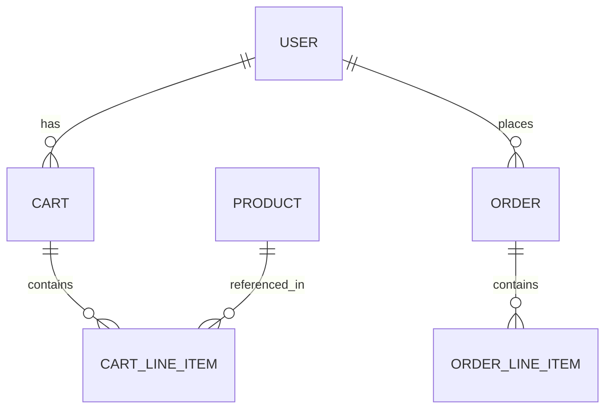

# 🗄️ Infrastructure & Schemas

## 3. Infrastructure & DevOps

### Docker Compose Configuration

#### Kafka Broker
Running Confluent Inc's **Kafka 6.2.0** and **Zookeeper**.
- Port: `9092` (Exposed)

#### Database Servers (PostgreSQL)
We follow the **Database-per-Service** pattern.

| Service | Image | Port | Database Name |
|:--------|:------|:-----|:--------------|
| `catalog_db_server` | postgres:14.0 | 5433 | `catalog_service` |
| `order_db_server` | postgres:14.0 | 5437 | `order_service` |
| `user_db_server` | postgres:14.0 | 5439 | `user_service` |
| `payment_db_server` | postgres:14.0 | 54xx | `payment_service` |

### Redis (New Feature)
**Redis** is implemented as a shared infrastructure component to ensure system stability.
- **Distributed Rate Limiting**: Utilized by the User Service to rate limit incoming authentication requests.
- **Port**: 6379

---

## 5. Database Schemas

### User Service Schema
```sql
CREATE TABLE "user" (
  id SERIAL PRIMARY KEY,
  username VARCHAR(255) NOT NULL,
  email VARCHAR(255) NOT NULL UNIQUE,
  password VARCHAR(255) NOT NULL
);
```

### Catalog Service Schema (Prisma)
```prisma
model Product {
  id          Int     @id @default(autoincrement())
  name        String
  description String
  price       Float
  stock       Int
}
```

### Order Service Schema (Drizzle)
- **Carts**: Stores temporary shopping sessions.
- **Orders**: Stores final placed orders.
- **Line Items**: Linked items for both carts and orders.

### Entity Relationship Diagram


---

## 6. Event-Driven Architecture

### Kafka Topics

| Topic | Producer | Consumer | Events |
|:------|:---------|:---------|:-------|
| `CatalogEvents` | Order Service | Catalog Service | `CREATE_ORDER`, `CANCEL_ORDER` |
| `OrderEvents` | Payment Service | Order Service | `CREATE_PAYMENT` |

### Message Broker Implementation
The system uses a shared wrapper pattern around `KafkaJS` to standardize connection handling, publishing, and subscribing across all services.
