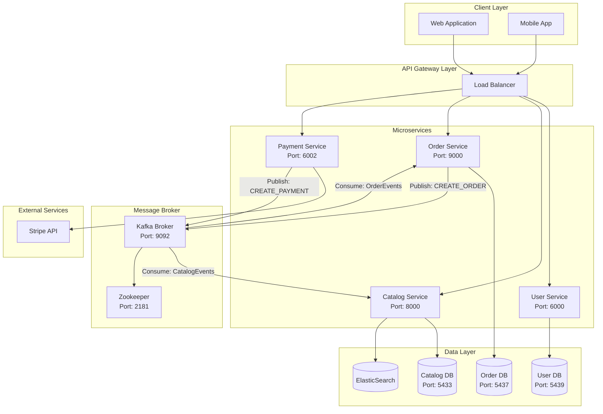
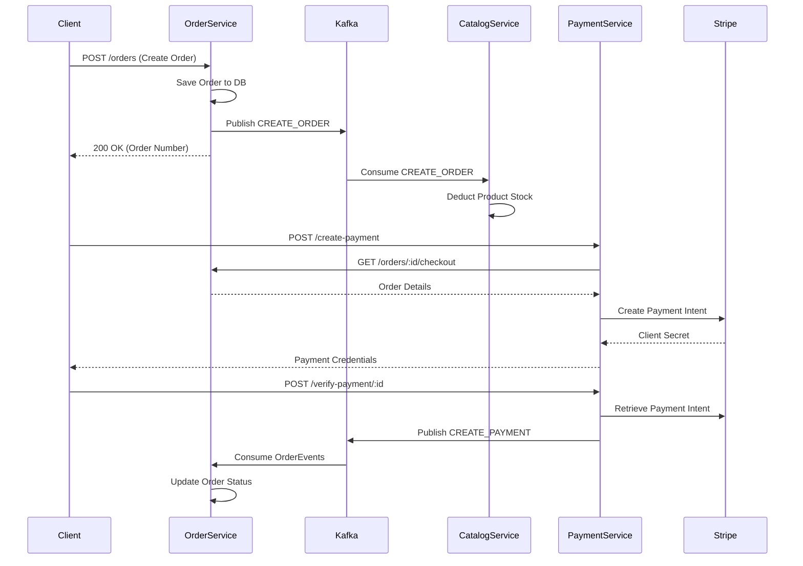

# 📌 Project Overview

## 1. Executive Summary

This project implements a **microservices-based e-commerce backend** designed for scalability, maintainability, and loose coupling. The system handles user authentication, product catalog management, shopping cart operations, order processing, and payment integration via Stripe.

### Key Architectural Decisions

| Decision | Implementation |
|:---------|:---------------|
| **Communication** | Synchronous (REST) for user-facing APIs; Asynchronous (Kafka) for inter-service events |
| **Database Strategy** | Database-per-service pattern with PostgreSQL |
| **Search** | ElasticSearch for product catalog queries |
| **Authentication** | JWT-based stateless authentication |
| **Payment** | Stripe Payment Intents API |

---

## 2. System Architecture

### High-Level Overview



### Communication Patterns



---

## 8. Directory Structure

```
microservice_kafka/
├── broker/
│   └── docker-compose.yml     # Kafka & Zookeeper
│
├── db/
│   ├── docker-compose.yml     # PostgreSQL containers
│   └── db-data/               # Persistent volumes
│
├── user_service/
│   ├── app.ts
│   ├── config/
│   ├── routes/
│   ├── types/
│   ├── db.sql
│   ├── package.json
│   └── tsconfig.json
│
├── catalog_service/
│   ├── src/
│   │   ├── api/
│   │   ├── services/
│   │   ├── repository/
│   │   ├── dto/
│   │   ├── interface/
│   │   ├── models/
│   │   ├── utils/
│   │   ├── expressApp.ts
│   │   └── server.ts
│   ├── prisma/
│   │   └── schema.prisma
│   ├── package.json
│   └── tsconfig.json
│
├── order_service/
│   ├── src/
│   │   ├── routes/
│   │   ├── service/
│   │   ├── repository/
│   │   ├── db/
│   │   │   ├── schema/
│   │   │   └── migrations/
│   │   ├── dto/
│   │   ├── utils/
│   │   ├── express-app.ts
│   │   └── server.ts
│   ├── drizzle.config.ts
│   ├── package.json
│
├── payment_service/
│   ├── src/
│   │   ├── routes/
│   │   ├── service/
│   │   ├── utils/
│   │   ├── express-app.ts
│   │   └── server.ts
│   ├── package.json
```
